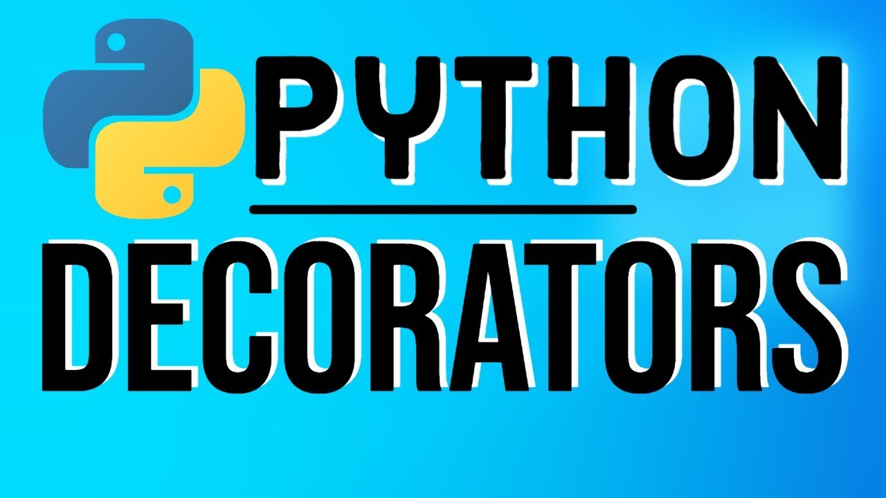

<h1 align="center">
    
</h1>

<h4 align="center"> 
	Decorators - Adicionando ou Removendo Funcionalidades de Funções já prontas 🚀
</h4>

  	
  
	
  
  

  
   

## 💻 Sobre Decorators

Um  

## 🛠  Tecnologias

As seguintes ferramentas foram usadas na construção do projeto:

- [Python]

## 🚀 Como executar o projeto

1. **Instalando**: pip install -r requirements.txt

## ➊ Pré-requisitos

- Antes de começar, você vai precisar ter instalado em sua máquina as seguintes ferramentas (O download pode ser realizado pela própria página do Python ou Anaconda):
[Python](https://www.anaconda.com/products/individual).

- Realizar a instalação do requirements, obtendo todas as bibliotecas necessárias para execução do projeto.

## 📝 Licença

Este projeto está sob a licença MIT.

Feito com ❤️ por **Emerson Rafael** 👋🏽 [Entre em contato!](https://www.linkedin.com/in/emerson-rafael/)

[Python]: https://www.python.org/downloads/